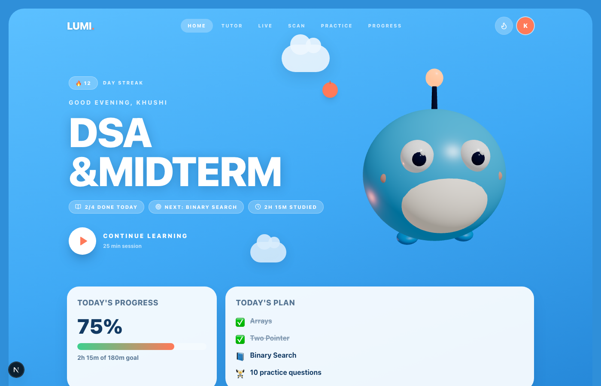
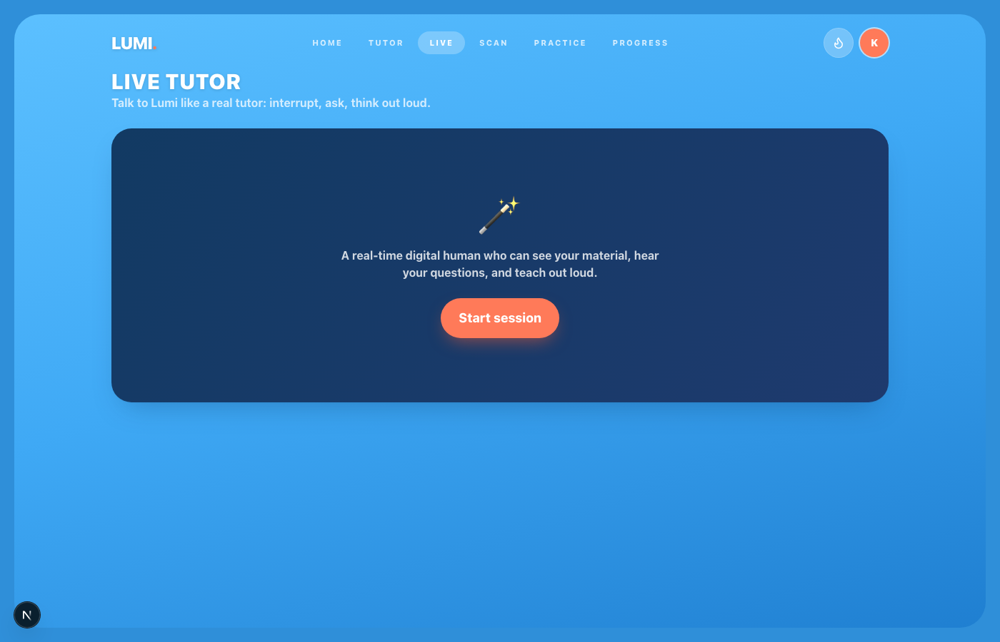
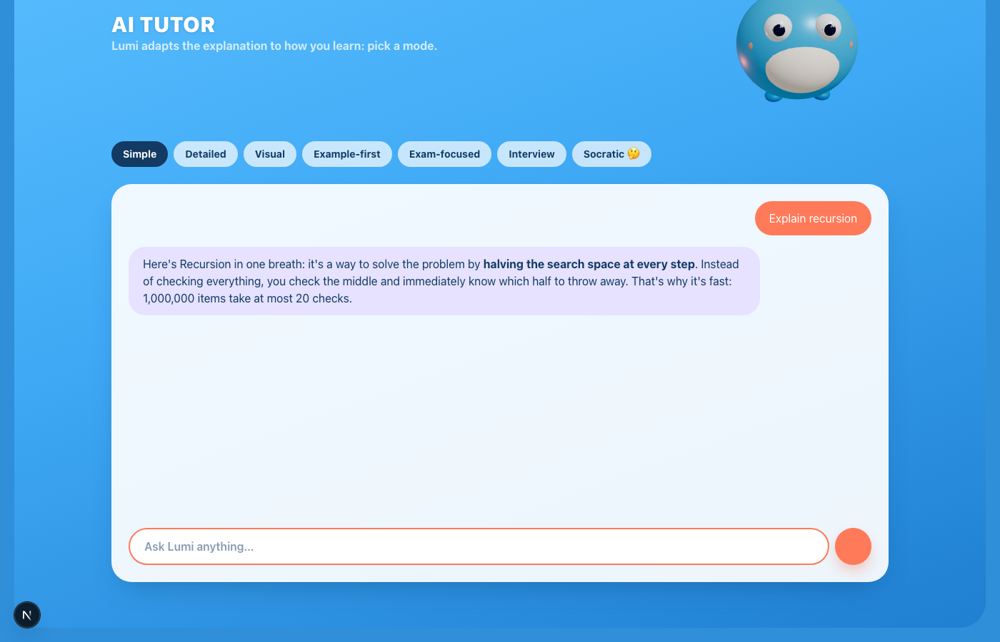
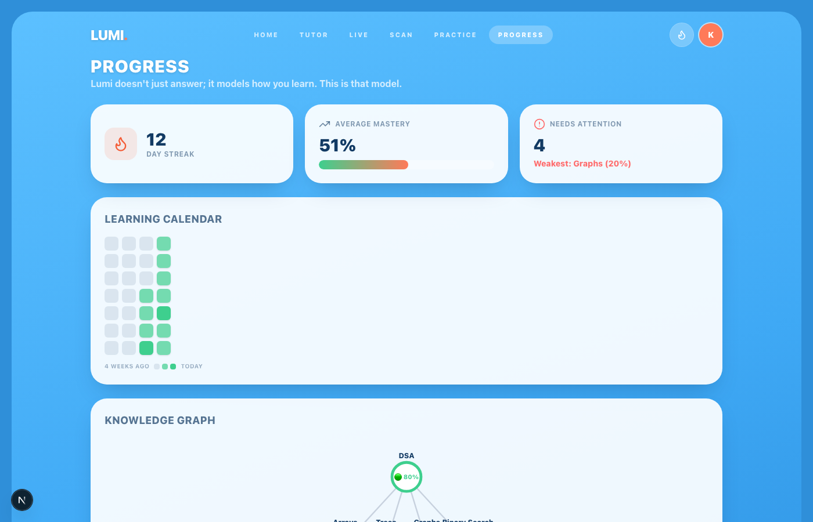
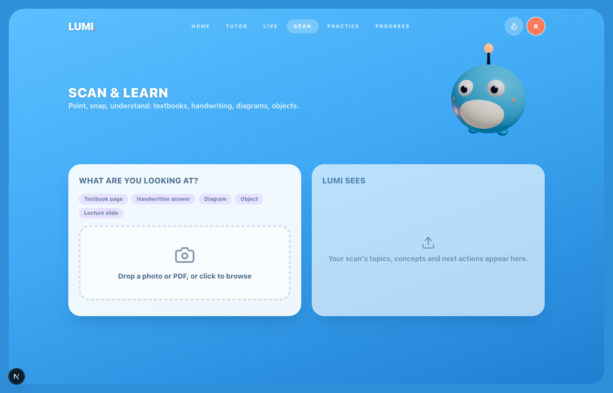
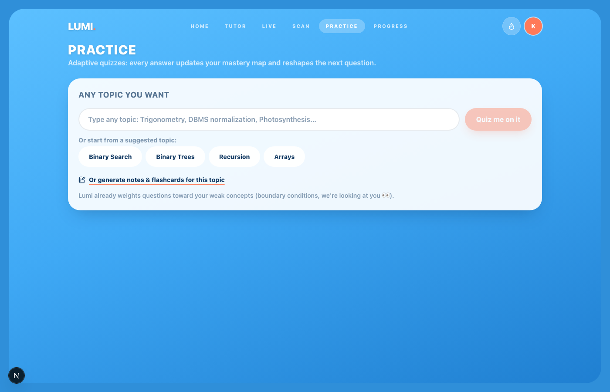

# LUMI.

> **The AI tutor that sees, hears, teaches, and learns with you.**
> Most AI tutors answer questions. LUMI builds an evolving model of how *you* learn.

LUMI is a multimodal AI learning companion built for the **Bharat Builds Tour: First Commit** hackathon (WeMakeDevs × AWS). Students ask through text or voice, speak to a real-time digital human, scan textbooks / handwritten work / PDFs, take adaptive quizzes, and get study plans that reshape themselves around measured weaknesses.

| Home (FUNTYX-style hero) | Live digital-human tutor |
| --- | --- |
|  |  |

| AI Tutor (with a live chat) | Progress (knowledge graph + streak calendar) |
| --- | --- |
|  |  |

| Scan & Learn (photo or PDF) | Practice (adaptive quiz on any topic) |
| --- | --- |
|  |  |

> Screenshots live in `docs/screenshots/` (captured via `scripts/capture-screens.cjs`).

---

## 🧠 The problem

Students juggle 8+ disconnected tools, and every AI tutor has amnesia:

- It doesn't know what you already understand
- It doesn't know what you got wrong yesterday
- It can't see your textbook or your handwritten solution
- It never says "you keep failing boundary conditions, let's fix *that*"

**LUMI closes the loop:**

```
LEARN → PRACTICE → MEASURE → FIND WEAKNESS → REINFORCE → PLAN NEXT STEP → LEARN
```

Every interaction becomes a **learning event** that updates a per-concept **mastery model** in DynamoDB, and the plan reshapes itself around it.

---

## ✨ What it does

| Area | What you get |
| --- | --- |
| 🏠 **Home** | FUNTYX-style hero: giant display mission title, glass chips, circular play CTA, 3D mascot bleeding off the frame |
| 💬 **AI Tutor** | 7 explanation modes: simple, detailed, visual, example-first, exam-focused, interview, **Socratic** (asks instead of answering). Scrollable chat window |
| 🎥 **Live Tutor** | Real-time **digital human** (Beyond Presence avatar) streamed over **LiveKit**, speaks with **Sarvam** Indian-voice TTS, mic toggle → speech → transcript → spoken reply |
| 📸 **Scan & Learn** | Upload a **photo or PDF**: textbook pages, handwritten solutions, diagrams → topic, concepts, and mistake-level feedback ("you moved +5 without flipping its sign") |
| 🏋️ **Practice** | Adaptive MCQs on **any topic you type**; wrong answers feed mastery; flashcards + revision notes per topic |
| 📊 **Progress** | Knowledge graph (🟢🟡🔴 mastery states), GitHub-style streak calendar, concept mastery bars, live event feed |

---

## 🏗️ Architecture

```
                    ┌────────────────────────────┐
                    │   Next.js (App Router)     │
                    │   TS · Tailwind · R3F 3D   │
                    └─────────────┬──────────────┘
                                  │  (frontend never calls AI directly)
                    ┌─────────────▼──────────────┐
                    │      Route handlers        │   /api/tutor/chat · /api/quiz/*
                    │   (API Gateway/Lambda-ready)│  /api/scan/analyze · /api/notes
                    └─────────────┬──────────────┘        /api/planner/* · /api/live/session
              ┌───────────────────┼────────────────────┐
              ▼                   ▼                    ▼
    ┌──────────────────┐ ┌──────────────────┐ ┌──────────────────┐
    │  Amazon Bedrock  │ │    DynamoDB      │ │  Sarvam / Bey    │
    │  Nova Lite       │ │  single-table    │ │  (via backend    │
    │  Converse API    │ │  student memory  │ │   proxies)       │
    │  text + vision   │ │  mastery·events  │ │  voice + avatar  │
    └──────────────────┘ └──────────────────┘ └──────────────────┘
```

**Hard architectural rules** (why this stands apart):

1. **The frontend never orchestrates AI.** Everything goes through server routes → API-Gateway/Lambda migration is 1:1.
2. **Every AI surface has a JSON schema** (spec §49). No arbitrary LLM blobs: `Explanation`, `Quiz`, `Notes`, `ScanResult`, `StudyPlan` are typed.
3. **Three swappable provider interfaces**, so vendors never leak into product code:

| Concern | Interface | Live | Fallback |
| --- | --- | --- | --- |
| AI reasoning | `AiProvider` | `BedrockProvider` (Nova) | `DemoProvider` (pedagogically real canned brain) |
| Student memory | `MemoryStore` | `DynamoDBStore` | `DemoStore` (seeded) |
| Voice | `VoiceProvider` | `SarvamVoiceProvider` | `BrowserVoiceProvider` (Web Speech) |

4. **The app never breaks because an API did.** Every Bedrock call is wrapped: failure → demo brain → screen keeps working. Same for voice.
5. **Keys never touch the browser.** Sarvam and Bey run through backend proxies (spec §63).

---

## ☁️ How AWS powers it (the honest list)

| Service | Role in LUMI |
| --- | --- |
| **Amazon Bedrock** (Converse API) | Central brain: tutoring, structured quiz/notes/plan generation, adaptive diagnostics |
| **Amazon Nova Lite** | Multimodal vision: OCR, textbook pages, diagrams, handwriting analysis (Scan & Learn) |
| **Amazon DynamoDB** | Single-table learning memory: `PK=student#id`, `SK=profile \| plan \| mastery#concept \| event#ts`. Every quiz answer `ADD`s to mastery counters atomically |
| **Amazon S3** | Learning-material storage configuration (bucket `lumi-learning-material`) |
| **IAM** | Least-privilege dev user: Bedrock + DynamoDB + S3 managed policies |
| **AWS Amplify Hosting** | Deployment + CI on every push (this URL) |

> Student-verifier bonus: built on AWS free tier + student credits. 🎓

**The full AWS loop in one user flow:** student submits a quiz → Lambda-style handler grades it → **DynamoDB** mastery counters update atomically → weaknesses detected → **Bedrock** generates targeted reinforcement questions → **EventBridge-shaped plan service** splices revision into tomorrow → Progress screen reflects the new mastery. That loop is the product.

---

## 🚀 Run it locally (zero keys needed)

```bash
git clone https://github.com/khushi-infinity/LUMI.git
cd LUMI
npm install
npm run dev          # http://localhost:3000 — full app in demo mode
```

To go live on AWS, `cp .env.example .env.local` and fill:

```bash
AWS_REGION=us-west-2            # where Nova Lite is invocable for your account
AWS_ACCESS_KEY_ID=...
AWS_SECRET_ACCESS_KEY=...
BEDROCK_MODEL_ID=amazon.nova-lite-v1:0
DYNAMODB_TABLE_NAME=lumi-student-state
SARVAM_API_KEY=...              # Indian-language voice (optional)
BEY_API_KEY=...                 # digital human (optional)
BEY_AVATAR_ID=...
LIVEKIT_URL=wss://...
LIVEKIT_API_KEY=...
LIVEKIT_API_SECRET=...
```

Then `node scripts/aws-setup.cjs` (validates creds, tests Bedrock, creates the DynamoDB table) and `node scripts/seed-dynamodb.cjs` (seeds the demo student).

---

## 📂 Project structure

```
src/
├── app/            # Home · Tutor · Live · Scan · Practice · Progress + /api/*
├── components/     # NavBar · 3D mascot (R3F) · KnowledgeGraph · ui kit
└── lib/
    ├── ai/         # AiProvider · BedrockProvider · DemoProvider · resilience wrapper
    ├── memory/     # MemoryStore · DynamoDBStore · DemoStore
    ├── voice/      # VoiceProvider · Sarvam (proxy) · Browser fallback
    ├── livekit.ts  # scoped JWT token signing for avatar rooms
    └── learning-engine.ts   # context assembly + learning events
scripts/            # aws-setup · seed-dynamodb · smoke tests
docs/architecture.md
PROGRESS.md         # honest done/remaining tracker
```

---

## 🎬 3-minute demo script

1. **0:00** Home: "LUMI knows my goal and my streak" → Continue Learning
2. **0:20** Tutor: Socratic mode asks back instead of answering
3. **0:50** Scan: drop a textbook PDF → topic, concepts, next actions
4. **1:20** Live: digital human appears, tap mic, speak, Lumi answers **out loud**
5. **1:50** Practice: quiz on "Photosynthesis" (any topic), submit → weakness detected
6. **2:20** Progress: mastery graph moved, plan auto-reinforced, streak calendar
7. **2:40** Architecture slide: Bedrock → DynamoDB → adaptive loop. "Lumi doesn't just answer students; it understands how they learn."

---

## 🗺️ Status & roadmap

See **[PROGRESS.md](PROGRESS.md)** for the honest build tracker.
Next up: SM-2 spaced repetition, learning-aware Pomodoro, Cognito auth, Bedrock Knowledge Bases RAG over uploaded textbooks, avatar lip-sync piping.

## 🙌 Credits

Amazon Bedrock · Amazon Nova · Amazon DynamoDB · Sarvam AI · Beyond Presence · LiveKit · Next.js · React Three Fiber · WeMakeDevs × AWS Bharat Builds Tour.

## 📄 License

MIT.
